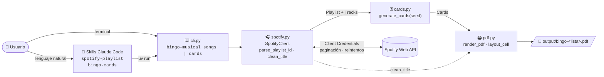
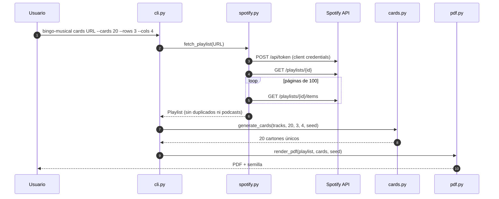

<div align="center">

# 🎵 Bingo Musical

**Convierte cualquier lista de Spotify en cartones de bingo listos para imprimir.**


</div>

---

## ✨ Qué hace

| | |
|---|---|
| 🎧 **Lee listas de Spotify** | Pega la URL de una lista pública y obtén todas sus canciones, sin duplicados ni podcasts. |
| 🃏 **Genera cartones únicos** | Elige cuántos cartones y cuántas filas × columnas. Nunca se repite una canción en un cartón ni hay dos cartones iguales. |
| 🖨️ **Ahorra tinta** | PDF A4 apaisado en blanco y negro: título de la canción y, debajo, el artista en letra más pequeña. |
| 📋 **Hoja de control** | Lista alfabética de todas las canciones con casillas para ir marcando las que suenan. |
| 🎲 **Reproducible** | Cada PDF lleva una semilla: con ella puedes reimprimir exactamente los mismos cartones. |
| 🤖 **Skills de Claude Code** | Pídeselo a Claude en lenguaje natural: *"hazme 20 cartones de 3×4 con esta lista"*. |

<table>
<tr>
<td align="center"><b>Cartón</b></td>
<td align="center"><b>Hoja de control</b></td>
</tr>
<tr>
<td></td>
<td></td>
</tr>
</table>

---

## 🚀 Puesta en marcha

### 1. Requisitos

- [uv](https://docs.astral.sh/uv/) (instala Python automáticamente si hace falta)
- Una cuenta de Spotify

### 2. Crea la app en Spotify

1. Entra en el [Spotify Developer Dashboard](https://developer.spotify.com/dashboard) y pulsa **Create app**.
2. Rellena nombre y descripción. En **Redirect URIs** pon `http://127.0.0.1:8888/callback` (ahora mismo no se usa, pero es obligatorio).
3. Marca **Web API** y guarda.
4. En **Settings** copia el **Client ID** y el **Client Secret**.

### 3. Configura el proyecto

```bash
uv sync                  # instala dependencias
cp .env.example .env     # y rellena las credenciales
```

```dotenv
SPOTIFY_CLIENT_ID=tu_client_id
SPOTIFY_CLIENT_SECRET=tu_client_secret
```

> [!IMPORTANT]
> `.env` está en `.gitignore`. No compartas nunca el Client Secret.

---

## 🛠️ Uso de los comandos

La URL puede ser de cualquiera de estas formas:

```text
https://open.spotify.com/playlist/37i9dQZF1DXcBWIGoYBM5M?si=...
https://open.spotify.com/intl-es/playlist/37i9dQZF1DXcBWIGoYBM5M
spotify:playlist:37i9dQZF1DXcBWIGoYBM5M
37i9dQZF1DXcBWIGoYBM5M
```

### 🎧 `songs` — ver las canciones de una lista

```bash
uv run bingo-musical songs "https://open.spotify.com/playlist/<id>"
```

```text
Clásicos de la Fiesta de Verano (Pedro) · 27 canciones
   1. Bohemian Rhapsody - Remastered 2011 — Queen
   2. Mediterráneo — Joan Manuel Serrat
   ...
```

Añade `--json` para obtener `{ id, name, owner, tracks: [{ id, name, artists }] }`.

### 🃏 `cards` — generar los cartones en PDF

```bash
uv run bingo-musical cards "https://open.spotify.com/playlist/<id>" --cards 20 --rows 3 --cols 4
```

```text
PDF generado: /…/bingo-musical/output/bingo-clasicos-de-la-fiesta-de-verano.pdf
Lista: Clásicos de la Fiesta de Verano (27 canciones)
Cartones: 20 de 3×4 · 21 páginas
Semilla: 482913
```

| Opción | Por defecto | Descripción |
|---|---|---|
| `--cards N` | `10` | Número de cartones (uno por página). |
| `--rows N` | `3` | Filas de cada cartón. |
| `--cols N` | `4` | Columnas de cada cartón. |
| `--seed N` | aleatoria | Semilla para regenerar los mismos cartones. |
| `--output RUTA` | `output/bingo-<lista>.pdf` | Dónde guardar el PDF. |
| `--no-control-sheet` | — | No añadir la hoja de control al final. |
| `--full-titles` | — | Mantener coletillas como `(feat. …)` o `- Remastered 2011`. |

> [!TIP]
> **¿Cuántas canciones necesito?** Como mínimo `filas × columnas`. Para que los cartones sean variados y no cante bingo medio salón a la vez, usa al menos **el doble** de canciones que casillas (un cartón 3×4 → 24+ canciones). Si hay pocas, el comando te avisa.

> [!NOTE]
> **¿Se ha estropeado un cartón?** Vuelve a lanzar el comando con la misma lista, filas, columnas y `--seed` que aparecen en el pie del PDF y obtendrás exactamente los mismos cartones (siempre que la lista no haya cambiado).

---

## 🤖 Uso con Claude Code

Abre Claude Code en la carpeta del proyecto y pídelo con tus palabras. Claude elegirá la skill adecuada y ejecutará el comando por ti.

| Skill | Cuándo se activa | Ejemplo de petición |
|---|---|---|
| **`spotify-playlist`** | Quieres ver o exportar las canciones de una lista. | *"¿Qué canciones tiene esta lista? https://open.spotify.com/playlist/…"* |
| **`bingo-cards`** | Quieres crear o reimprimir cartones. | *"Hazme 25 cartones de 4×5 con esta lista y sin hoja de control"* |

También puedes invocarlas directamente:

```text
/bingo-cards https://open.spotify.com/playlist/<id> 30 cartones de 3x3
/spotify-playlist https://open.spotify.com/playlist/<id>
```

Claude te devolverá la ruta del PDF y la semilla usada.

---

## 🏗️ Arquitectura





| Módulo | Responsabilidad |
|---|---|
| `spotify.py` | Token Client Credentials, paginación, reintentos ante `429`/`401`, filtrado de episodios y pistas locales, deduplicado y limpieza de títulos. |
| `cards.py` | Lógica pura: reparte canciones al azar con semilla, garantiza cartones distintos y valida que haya suficientes canciones. |
| `pdf.py` | Maquetación con reportlab: rejilla, ajuste automático del tamaño de letra, fuente TTF con tildes y hoja de control paginada. |
| `cli.py` | Punto de entrada `bingo-musical` y mensajes de error legibles. |

---

## 📁 Estructura del proyecto

```text
bingo-musical/
├── 📄 pyproject.toml            # dependencias y entrypoint `bingo-musical`
├── 🔐 .env.example              # plantilla de credenciales de Spotify
├── 📘 CLAUDE.md                 # guía para Claude Code
├── 🤖 .claude/skills/
│   ├── spotify-playlist/SKILL.md
│   └── bingo-cards/SKILL.md
├── 🐍 src/bingo_musical/
│   ├── cli.py                   # comandos songs / cards
│   ├── spotify.py               # cliente de la API de Spotify
│   ├── cards.py                 # generación de cartones
│   └── pdf.py                   # render del PDF
├── 🧪 tests/
│   ├── test_spotify.py          # API simulada con httpx.MockTransport
│   ├── test_cards.py
│   └── test_pdf.py
├── 🖼️ docs/                     # capturas del README
└── 📂 output/                   # PDFs generados (ignorado en git)
```

---

## 🧪 Tests

```bash
uv run pytest                                              # todos
uv run pytest tests/test_pdf.py                            # un fichero
uv run pytest tests/test_cards.py::test_same_seed_same_cards   # un test
```

Los tests no llaman a Spotify: las respuestas de la API se simulan.

---

## 🩺 Problemas frecuentes

| Mensaje | Causa y solución |
|---|---|
| `Faltan credenciales de Spotify` | No existe `.env` o está vacío. Copia `.env.example` y rellena las dos variables. |
| `No se pudo obtener el token (400/401)` | Client ID o Secret incorrectos. Cópialos de nuevo desde **Settings** de la app. |
| `Spotify no encuentra la lista` (404) | La lista es privada o es editorial/algorítmica de Spotify (*Top 50*, *Descubrimiento semanal*…), que las apps nuevas no pueden leer. **Solución:** copia sus canciones a una lista pública tuya. |
| `Acceso denegado` (403) | Restricción de Spotify para apps en modo desarrollo. |
| `La lista tiene X canciones y un cartón … necesita Y` | Reduce filas/columnas o usa una lista más larga. |
| Caracteres que no se ven en el PDF | La fuente del sistema (Arial/DejaVu) no incluye ese alfabeto o emoji. |

---

<div align="center">

Hecho con 🎶 para fiestas, bodas, cumpleaños y cenas de empresa.

</div>
